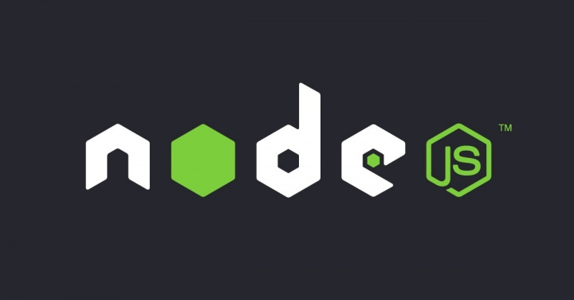

<h1 align="center">
 Trilha nodejs - Back-end
</h1>

<h3 align="center">
    
    <br><br>

</h3>

## 📝 Sobre o Projeto

O <strong>NPS-API</strong> é uma API Restful para Net Promoter Score.

Aplicação back-end construída na trilha <strong>NodeJS</strong> da <strong>Next Level Week</strong> distribuída pela [Rocketseat](https://rocketseat.com.br/).

## 🚀 Tecnologias

Esse projeto foi desenvolvido com as seguintes tecnologias:

- [Node.js](https://nodejs.org/en/)
- [Express](https://expressjs.com/pt-br/)
- [TypeORM](https://typeorm.io/)
- [nodemailer](https://nodemailer.com/about/)
- [Yup](https://github.com/jquense/yup)

## ⤵ Comandos para começar

Foram implementados testes de integração.

```bash
- git clone https://github.com/cesaraugustomt/nlw_04_nodejs.git
- cd api
```

Instalando dependências

```bash
- npm install
```

ou

```bash
- yarn install
```

Gerar o arquivo de database.sqlite do Sqlite3, onde ficaram armazenados as tabelas da API

```bash
- yarn devDB
```

Criando as migrations do Sqlite3 por meio do cli do TypeOrm

```bash
- yarn typeorm migration:run
```

Inicializando uma instância local (Script configurado no package.json)

```bash
- yarn dev
```

## ⤵ Testes

Para testar se a aplicação passa em todos os testes de integração, utilize o comando:

```bash
- yarn test
```

## 🔗 Links do projeto

### Notion

- [Ambiente](https://www.notion.so/Configura-es-do-ambiente-Node-js-ae9fea3f78894139af4268d198294e2a)
- [Aula 1](https://www.notion.so/Dia-1-Fundamentos-do-NodeJS-a0040fa51a764bdaaf5648fedbf6fb4d)
- [Aula 2](https://www.notion.so/danileao/Dia-2-Iniciando-com-o-Banco-de-Dados-ffa8a141872641b7b13338f339d7a69b)
- [Aula 3](https://www.notion.so/Dia-3-Testando-a-nossa-aplica-o-6b517e6d081241258009c640f7032cde)
- [Aula 4](https://www.notion.so/danileao/Dia-4-Envio-de-e-mail-1b85cb36f0a84e5e90a43e3acbce5674)
- [Aula 5](https://www.notion.so/Dia-5-Finalizando-nossa-api-com-valida-es-1f972c0e73a548fc84217ddf79fb7d90)

## 📝 License

Esse projeto está sob a licença MIT. Veja o arquivo [LICENSE](LICENSE) para mais detalhes.

---
